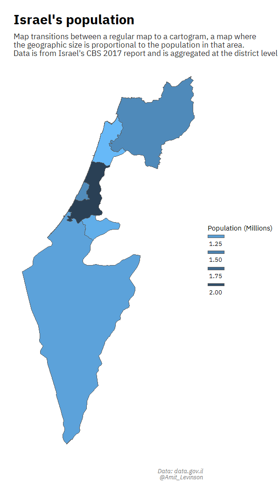
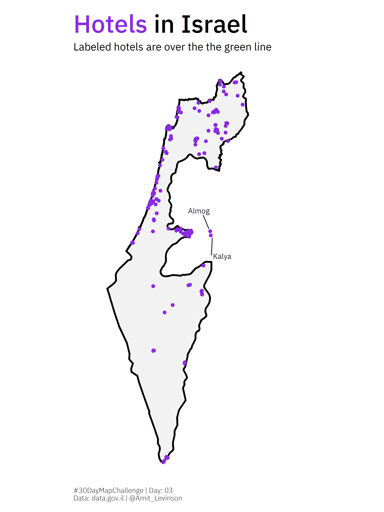

# 30daymapchallenge

### What's this project all about?

Taken from the [GitHub page](https://github.com/tjukanovt/30DayMapChallenge) of the project:

> "The idea is to create (and publish) maps based on different themes on each day of the month using the hashtag #30DayMapChallenge, You can prepare the maps beforehand, but the main idea is to publish maps from specific topics on specific days listed below. Just include a picture of the map when you post to Twitter with the hashtag. You don't have to sign up anywhere to participate. There are no restrictions on the tools, technologies and the data you use in your maps. Doing less than 30 is also fine (and actually doing all 30 is really hard!)..."

#### How do I see it?

**I don't get to plot maps that often in my daily work, so I find this challenge a great opportunity in doing so.** I'll try to do as many as possible, and you can find below all of the attempts including links to the code for you to explore. 

Enjoy!

## 2020

### Day 20 - Population (Animated + static)

[Link to code](https://github.com/AmitLevinson/30daymapchallenge/blob/main/2020/Code/20_population/population.R)

 

### Day 08 - Yellow

[Link to code](https://github.com/AmitLevinson/30daymapchallenge/blob/main/2020/Code/08_yellow/08_yellow.R)

 

### Day 07 - Green

[Link to code](https://github.com/AmitLevinson/30daymapchallenge/blob/main/2020/Code/07_green/07_green.R)

 

### Day 03 - Polygon  

[Link to code](https://github.com/AmitLevinson/30daymapchallenge/blob/main/2020/Code/03_Polygons/03_polygons.R)

 

### Day 02 - Lines  

[Link to code](https://github.com/AmitLevinson/30daymapchallenge/blob/main/2020/Code/02_lines/02_lines.R)

 

### Day 01 - Points  

[Link to code](https://github.com/AmitLevinson/30daymapchallenge/blob/main/2020/Code/01_points/01_points.R)

<a href="#top"> Back to top</a>